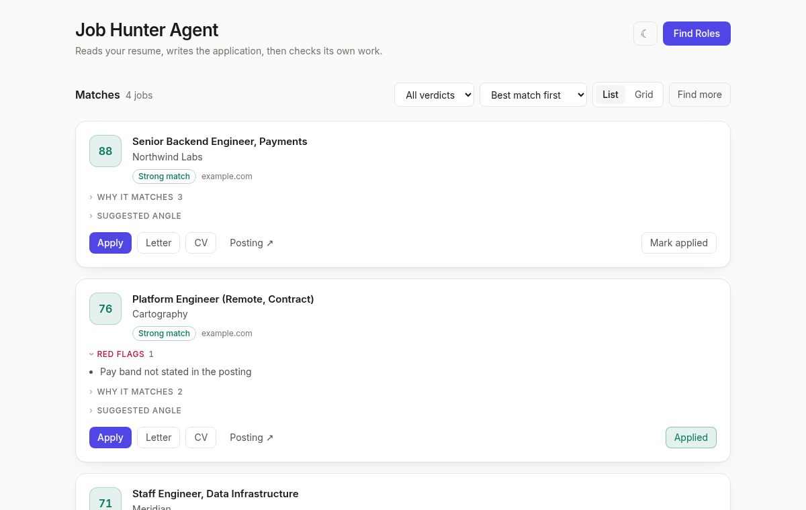

# Job Hunter Agent

[](https://buymeacoffee.com/YahyaZekry)

Reads your resume, finds remote jobs worth applying to, and writes the application: a one-page PDF CV per job, and a cover letter on demand.

Then it checks its own work. A second Claude reads each letter with fresh context and cuts anything it can't trace back to a line in your resume.

<picture>
  <source media="(prefers-color-scheme: dark)" srcset="docs/dashboard-dark.png">
  
</picture>

Works for **any profession** — developer, designer, virtual assistant, writer, accountant. Roles, queries, scoring, and copy all come from your `resume.md`; nothing about your field is hardcoded.

## Why the review matters

LLMs embellish. On real runs this one caught:

- **"four years"** — the resume said 2021–present, which is five
- **"available full-time"** — the current role was listed as part-time
- **a tool claimed as a core skill** — it appeared in the resume's skills list with no project behind it

Each is the kind of thing that falls apart in an interview. The reviewer sees only the posting, your resume, and the draft — not its own reasoning for writing it — so it has no stake in defending the text.

## Quick start

```bash
python -m venv .venv && .venv/bin/pip install -r requirements.txt
cp .env.example .env     # add FIRECRAWL_API_KEY
```

Drop your resume at `resume.md` (gitignored, never leaves your machine), then:

```bash
.venv/bin/python server.py    # → http://127.0.0.1:8000
```

**Needs:** Python 3.10+, the [`claude` CLI](https://claude.com/claude-code) authenticated, a [Firecrawl](https://firecrawl.dev) key.
**Optional:** [`typst`](https://github.com/typst/typst) for CVs, `pdftotext` (poppler) for the ATS check, an [Exa](https://exa.ai) key for pages Firecrawl can't reach.

## How it works

| Step | What happens |
|------|--------------|
| **0. Find roles** | Claude reads your resume → target roles + key skills. You pick which ones this run covers. |
| **1. Build queries** | Roles, skills, and your preferences → search queries, one per source. |
| **2. Discover & scrape** | Firecrawl searches, then scrapes a batch of result pages into individual postings. |
| **3. Score** | Every posting scored 0–100 against your profile: skills, seniority, remote signals, freshness, location, language, red flags. |
| **4. CVs** | For each `apply` verdict, a Typst CV aimed at that posting, compiled to PDF and checked the way an ATS would read it. |

Cover letters aren't written in bulk. You ask for one job at a time, and it gets fact-checked before you see it — see below.

## Features

**Cover letter** — one button per job. If a letter exists it opens; if not, it offers to write one. Claude drafts it from your resume, then a second Claude that never saw it being written checks every claim against `resume.md` and removes what it can't find. You get the finished letter, a Copy button, and a collapsed "what was checked" section holding the claims that were cut, what the job asked for versus what you actually have, and the original draft.

Everything is archived to `output/applications/<company>__<role>/` and tracked in `output/applications.csv`.

**Find more jobs** — a search turns up far more pages than one run scrapes (46–168 in practice, 20 scraped). The rest are queued, not discarded. This scrapes the next batch: no repeated search, no page scraped twice, and copy already written is skipped. Cheaper than re-running. No single site takes more than 3 pages per batch, so one careers page can't eat the budget.

**Preferences** — chips for employment type, pay/currency, and location, folded into both the queries *and* the scoring. "Worldwide Remote" and a specific country are mutually exclusive so they can't widen into "worldwide **or** Egypt". Note that typing a country searches *for* it — there's no exclude.

**Plain English** — the letter prompt bans em dashes, stock phrases ("passionate about", "proven track record"), and inflated vocabulary; the reviewer flags any that slip through, and a regex strips dashes as a last resort. Letters should read like a person emailing a stranger about a job.

**One-page CVs** — overflow triggers one regeneration with instructions to cut the least relevant material. `templates/cv.typ` is the styling reference; edit it and preview with `typst compile templates/cv.typ`.

## Output

Everything lands in `output/` (gitignored):

| Path | Contents |
|------|----------|
| `jobs.json` | Scored jobs |
| `raw_jobs.json` | Everything scraped |
| `page_queue.json` | Discovered pages + which are already scraped |
| `cvs/` | Tailored `.typ` sources + compiled `.pdf`s |
| `applications/<slug>/` | Archived posting, first draft, review, final letter |
| `applications.csv` | The tracker |

## Configuration

`config.json` sets where the agent searches — `job_boards` (one query each) and `reddit_groups` (grouped, with optional `extra_terms`). Defaults are globally remote-first with no region-specific boards.

If your field has dedicated boards, add them. Note that `job_boards` are queried every run regardless of your location preference, so a region-tied board keeps surfacing that region no matter what you type.

## Development

```bash
.venv/bin/python -m pytest       # 84 tests, everything external mocked
.venv/bin/python agent.py        # headless, no UI
```

```
agent.py          # the whole pipeline + the apply stage
server.py         # FastAPI, SSE for progress
ui/index.html     # single-file dashboard, no build step
prompts/          # one Claude prompt per step
templates/cv.typ  # CV layout
```

`.project-knowledge/` holds the living docs — architecture, schema, decisions, and a roadmap of known limits.

## Known limits

- Listing pages often yield teaser-length descriptions; the full text isn't on the page to scrape
- LinkedIn returns nothing usable through Firecrawl or Exa
- `posted_date` arrives as free text ("11 months ago") and feeds the freshness rule unnormalized

## Support

Built while job hunting, and it runs on a Claude Code subscription plus Firecrawl's free tier for exactly that reason. If it saved you hours of scrolling or helped you land an interview:

[](https://buymeacoffee.com/YahyaZekry)

## Credits & license

MIT. Originally created by [Kurt De Austria](https://github.com/Kurt-Chan) as [ai-job-scraper](https://github.com/Kurt-Chan/ai-job-scraper) — the pipeline shape is his. Substantially extended since: CV generation, the drafter-reviewer flow, the application tracker, and the discovery/scrape rework.

Both copyright notices are preserved in [`LICENSE`](LICENSE), as MIT requires.

Stars, issues, and PRs appreciated. ☕
